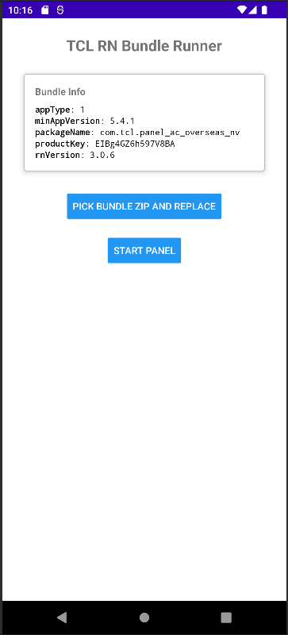
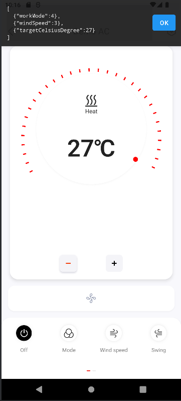

# TCL RN Bundle Runner (React Native 0.69.5)

A minimal Android host app for running TCL Home App React Native bundles packaged as ZIP files. 
It installs a ZIP at runtime, provides lightweight shims for common modules and launches the panel.

## AWS Shadow Emulation
- App is used to inspect the AWS IoT Device Shadow values that the app would send to a server.
- Works fully offline.
- Allows emulating real device shadow behavior locally for development and debugging.

## Screenshots

## Requirements
- Node.js 16+
- Java 11 (recommended for RN 0.69.x) and Android SDK/NDK toolchain.
- Android Studio (for emulator/device and Gradle builds).

## Setup
- Install dependencies: `npm install`

## Android
- Debug build & install using adb: `npx react-native run-android`
- Generate release apk: `cd android && ./gradlew assembleRelease`

## Using the Runner (Android)
1. Launch the app: “TCL RN Bundle Runner”.
2. Tap “Pick Bundle ZIP and Replace” and select your panel ZIP (via the system picker).
3. If install succeeds, the Bundle Info card updates from the ZIP.
4. Tap “Start Panel” to launch the panel.
5. To replace the panel, repeat step 2; the app resets state and applies the new bundle.

